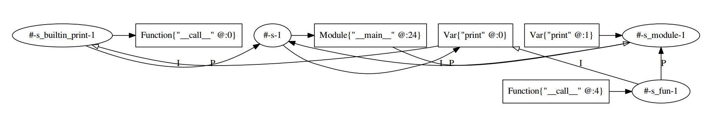

# Milestone 1

In this first milestone we aimed to create an initial pipeline that could convert a simple Python print statement to Web-Assembly.
This process is done in several stages that are shortly described below.

## Parsing
We implemented parsing according to the official Python 3.6 syntax (as described [here](https://docs.python.org/3/reference/grammar.html)).
This official syntax uses a nested hierarchy to implement precedence rules. We decided to follow this syntax, as it was the official way in which it is done, despite that using the priorities in SDF3 could result in a more clean solution. As suggested by Jasper, it might result in an interesting case study to implement both ways and compare them. 

We focussed on getting a simple print statement to work but as the official syntax is already fully described, we opted to write all the constructs already. There are some problems with more complex programs, but for time reasons we did not spend much time on improving the syntax (by for example removing typos). This also meant that we did not fully investigate the layout sensitive syntax. 


## Desugaring to AST
As the resulting syntax tree is deeply nested and overly complex, we have to desugar the tree into a better AST. This AST is also the AST that Python uses internally and is documented [here](https://docs.python.org/3/library/ast.html).
For this desugaring step we only worked towards supporting the aforementioned print statement, again for time reasons.

The most complex program we can currently parse and desugar is of the form: 
```
a.b.func(12, 13 & 14)
```

This converts the parsed syntax tree: 
```
FileInput(
  [ Statement(
      SimpleStatement(
        [ Expression(
            Exp(
              [ XorExp(
                  [ AndExp(
                      [ ShiftExp(
                          ArithExp(
                            Term(
                              Power(
                                Power(
                                  AtomExp(
                                    None()
                                  , ID("a")
                                  , [ DotName("b")
                                    , DotName("func")
                                    , ArgList(
                                        Some(
                                          ArgList(
                                            [ CompForArgument(
                                                Test(
                                                  OrTest(
                                                    AndTest(
                                                      Comparison(
                                                        Exp(
                                                          [ XorExp(
                                                              [ AndExp(
                                                                  [ ShiftExp(
                                                                      ArithExp(
                                                                        Term(
                                                                          Power(Power(AtomExp(None(), Int("12"), []), None()))
                                                                        , []
                                                                        )
                                                                      , []
                                                                      )
                                                                    , []
                                                                    )
                                                                  ]
                                                                )
                                                              ]
                                                            )
                                                          ]
                                                        )
                                                      , []
                                                      )
                                                    , []
                                                    )
                                                  , None()
                                                  )
                                                , None()
                                                )
                                              , None()
                                              )
                                            , CompForArgument(
                                                Test(
                                                  OrTest(
                                                    AndTest(
                                                      Comparison(
                                                        Exp(
                                                          [ XorExp(
                                                              [ AndExp(
                                                                  [ ShiftExp(
                                                                      ArithExp(
                                                                        Term(
                                                                          Power(Power(AtomExp(None(), Int("13"), []), None()))
                                                                        , []
                                                                        )
                                                                      , []
                                                                      )
                                                                    , []
                                                                    )
                                                                  , ShiftExp(
                                                                      ArithExp(
                                                                        Term(
                                                                          Power(Power(AtomExp(None(), Int("14"), []), None()))
                                                                        , []
                                                                        )
                                                                      , []
                                                                      )
                                                                    , []
                                                                    )
                                                                  ]
                                                                )
                                                              ]
                                                            )
                                                          ]
                                                        )
                                                      , []
                                                      )
                                                    , []
                                                    )
                                                  , None()
                                                  )
                                                , None()
                                                )
                                              , None()
                                              )
                                            ]
                                          , None()
                                          )
                                        )
                                      )
                                    ]
                                  )
                                , None()
                                )
                              )
                            , []
                            )
                          , []
                          )
                        , []
                        )
                      ]
                    )
                  ]
                )
              ]
            )
          )
        ]
      , None()
      )
    , ""
    )
  ]
)
```

Into the desugared AST:

```
Module(
  [ ExprStmt(
      Call(
        Attribute(
          Attribute(Name(ID("func"), Load()), ID("b"), Load())
        , ID("a")
        , Load()
        )
      , [Int("12"), BinOp(BitAnd(), Int("13"), Int("14"))]
      , []
      )
    )
  ]
)
```

## Name Binding Analysis
For the name binding analysis we started working on a scope graph. This scope graph has the following structure for the simple print statement:


At the moment the analysis is able to identify whether the called function is defined (which holds in the case of `print`). When it is not defined, a warning is shown. This is because in Python you can never be sure that items are undefined.
This scope graph also allows to infer that certain objects are callable (by the presence of a `__call__` function).

### Desugaring
The name binding analysis needed to be extended by a small desugaring step. This is because a function call with positional arguments only stores the argument values. We added a rule that makes it that those arguments are now identifiable by an indexed number. 

## Transformation to Wasm AST

## Pretty-print to Wasm
