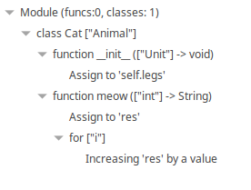
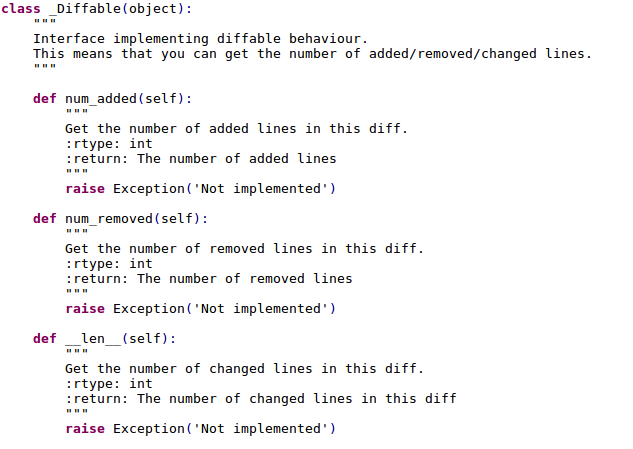
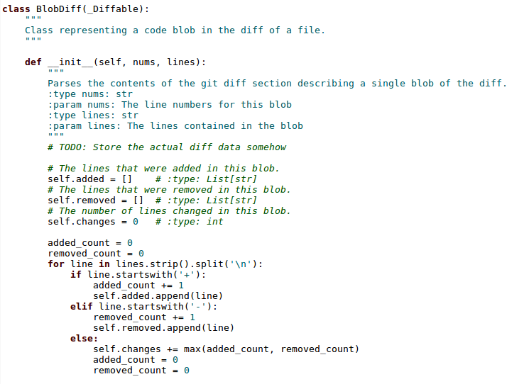

# Milestone 4
This milestone was mainly focussed on creating an Eclipse plugin and increasing the coverage of the code generation.

## Eclipse plugin
Developing the eclipse plugin consisted of three main parts. Besides the plugin itself we wanted to provide the user with a more custom experience by providing an outline of the code and customask code coloring. These will be discussed shortly in the following sections, followed by the actual plugin.

### Outline
The first editor feature we liked to provide was an outline view of the program. The outline we created shows the following elements:
- The module itself
- Class definitions
- Function definitions
- Assignments
- Flow-statements (if, for, while)

Most of the flow-statements can also contain else branches, wich are also displayed inside the nested nodes.
For the following Python code, this results in the outline view shown in the image below.

```python
class Cat(Animal):
    def __init__(self)-> None:
        self.legs = 4

    def meow(n: int)-> str:
        res = ''
        for i in range(n):
            res += 'meow\n'
        return res            

```



### Coloring
Besides the outline we also wanted to include proper coloring. Before implementing this we used the default coloring, which was not properly coloring all constructs.
Aplying the colors was straightforward, however not everything could be correctly colored. Two examples of this are variables named `self` and the type annotations. The reasons for this are simple. In the case of `self`, there is no way to distinguish this name from any other ID, making it impossible to color differently. The type annotations do have a language construct that can be colored. When aplying a color to this construct only the colon and arrow will have the correct color, the type will remain black (as this is an ID and IDs are black).

In the images below you can see the text coloring before and after:




### Eclipse plugin
Exporting the Eclipse plugin should be easy: just run `mvn clean verify` in the plugin package. In our case this was not the case however, as it produced an empty folder that (obviously) did not contain the plugin. After a lot of trial and error and referencing other project repositories, it was found that the problem lied in the fact that we did not have a toplevel pom-file for the entire project. Adding such a file resulted in a lot of other errors. As no clear difference was found between other projects, this took some time to fix. In the end it turned out that we were also missing a `.mvn`-folder. Now the entire project built correctly and we were able to generate and verify the plugin.
